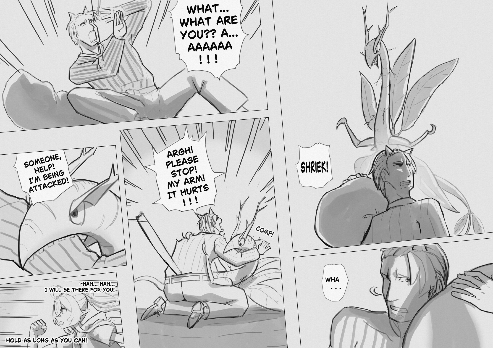
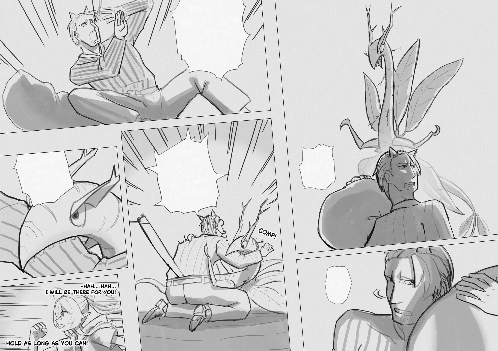
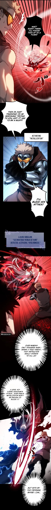
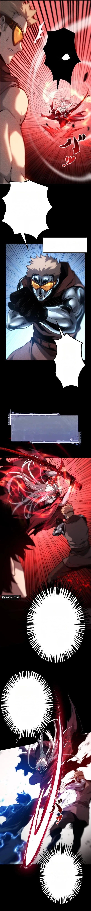

# Manga Cleaner 🧹

An end-to-end AI-powered web application that automatically detects speech bubbles and erases text from manga and manhwa pages while cleanly preserving the bubble borders and background artwork.

🌐 **Live Demo:** [https://mangacleaner-production.up.railway.app](https://mangacleaner-production.up.railway.app)

---

## 📸 Examples & Results

### 1. Black & White Manga (B&W)

| Original Image | Cleaned (Text Removed) |
| :---: | :---: |
|  |  |

### 2. Full-Color Webtoon / Manhwa

| Original Image | Cleaned (Text Removed) |
| :---: | :---: |
|  |  |

---

## 💡 Overview & Pipeline

This project combines deep learning segmentation with computer vision algorithms:
1. **AI Segmentation**: Uses a YOLOv8 instance segmentation model fine-tuned on speech bubbles to predict bubble polygons.
2. **Text Isolation & Border Protection**: Applies adaptive thresholding and Connected Component Analysis (CCA) inside each bubble to isolate text strokes while safeguarding bubble outlines.
3. **Telea Inpainting**: Seamlessly fills the isolated text regions using OpenCV inpainting.
4. **FastAPI & Web UI**: Provides a responsive dark-theme interface with split-view comparison, image paste (Ctrl+V), and download options.

---

## ✨ Features

- 🎯 **Accurate Balloon Detection**: Detects speech bubbles of varying shapes, orientations, and colors.
- 🛡️ **Frame & Border Protection**: Separates outer frame strokes from text so bubble outlines are never erased.
- 🧹 **Complete Text Removal**: Uses contrast analysis and morphological closing to eliminate hollow/half-erased glyphs.
- 🎨 **Inpainting Reconstruction**: Inpaints text regions smoothly matching the surrounding bubble tone.
- 📋 **Clipboard Support**: Paste images directly from your clipboard (`Ctrl+V` / `Cmd+V`).
- 🖥️ **Interactive Web Interface**: Split-view and single-view modes with real-time debug visualization and batch processing.

---

## 🛠️ Tech Stack

- **Backend / API**: [FastAPI](https://fastapi.tiangolo.com/), [Uvicorn](https://www.uvicorn.org/)
- **Computer Vision & AI**: [Ultralytics YOLOv8](https://github.com/ultralytics/ultralytics), [OpenCV](https://opencv.org/), [NumPy](https://numpy.org/)
- **Frontend**: Vanilla HTML5, CSS3 (Modern Dark Theme), JavaScript (Fetch API)
- **Deployment**: [Railway](https://railway.app/), Docker

---

## 🚀 Getting Started

### Prerequisites

- Python `>= 3.11`
- [uv](https://github.com/astral-sh/uv) (recommended) or standard `pip`

### 1. Clone the Repository

```bash
git clone https://github.com/Teemo4621/manga-cleaner.git
cd manga-cleaner
```

### 2. Install Dependencies

Using `uv`:
```bash
uv sync
```

Or using `pip`:
```bash
pip install -r requirements.txt
```

### 3. Run Locally

Start the FastAPI server:
```bash
uv run server.py
# Or: python server.py
```

Then open your browser at:
```
http://127.0.0.1:8000
```

---

## 🐳 Docker Deployment

You can run the application containerized using Docker:

```bash
# Build Docker image
docker build -t manga-cleaner .

# Run container on port 8000
docker run -p 8000:8000 manga-cleaner
```

---

## 🎖️ Credits & Acknowledgements

- **Speech Bubble Segmentation Model**: Fine-tuned model by [@huyvux3005](https://huggingface.co/huyvux3005) on the [Manga109](http://www.manga109.org/) dataset.
  - Model weights & details: [huyvux3005/manga109-segmentation-bubble on Hugging Face](https://huggingface.co/huyvux3005/manga109-segmentation-bubble)
- **Dataset**: Manga109 dataset for research and academic manga analysis.
- **Frameworks**: Ultralytics YOLOv8 & FastAPI.